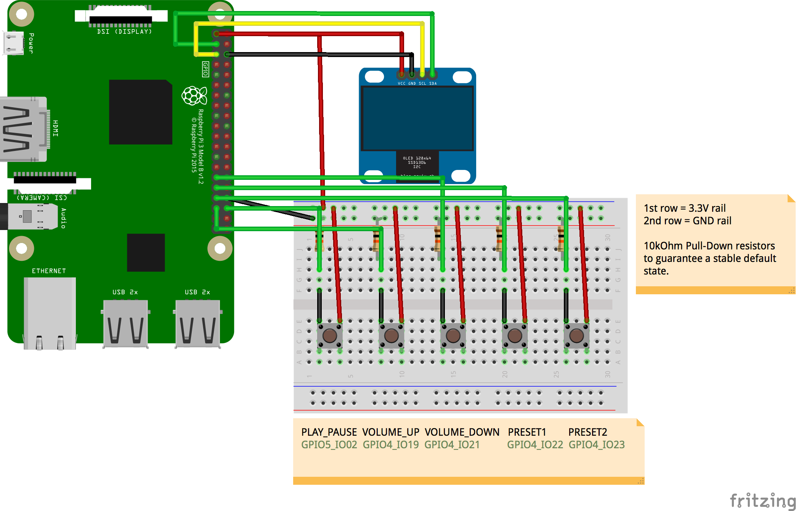

# Sonos remote controller for Android Things
=============================================

This project is a showcase of an Android Things based hardware remote controller for Sonos wireless home sound system.
It has been created for the contest "Android Things: Rapid Prototypes to Real Products".

Pre-requisites
--------------

- Android Things compatible board (example has been created with NXP PICO-PI-IMX6UL)
- Android Studio 3.0+
- Sonos Speaker
- 1 [SSD1306 OLED screen](https://www.adafruit.com/product/326)
- jumper wires
- 1 breadboard

Schematics
----------

Build and install
=================
On Android Studio, click on the "Run" button.

    public void onPreset1Clicked() {
        // fill in your favorite streaming URI and player configuration
        try {
            if (sonosDevice != null) {
                sonosDevice.playUri("x-rincon-mp3radio://www.charivari.de/webradio/955-charivari-stream-webradio.m3u", null);
                sonosDevice.setVolume(35);
                updateView(SONOS_ZONE, "Charivari");
            }
        } catch (IOException e) {
            e.printStackTrace();
        } catch (SonosControllerException e) {
            e.printStackTrace();
        }
    }